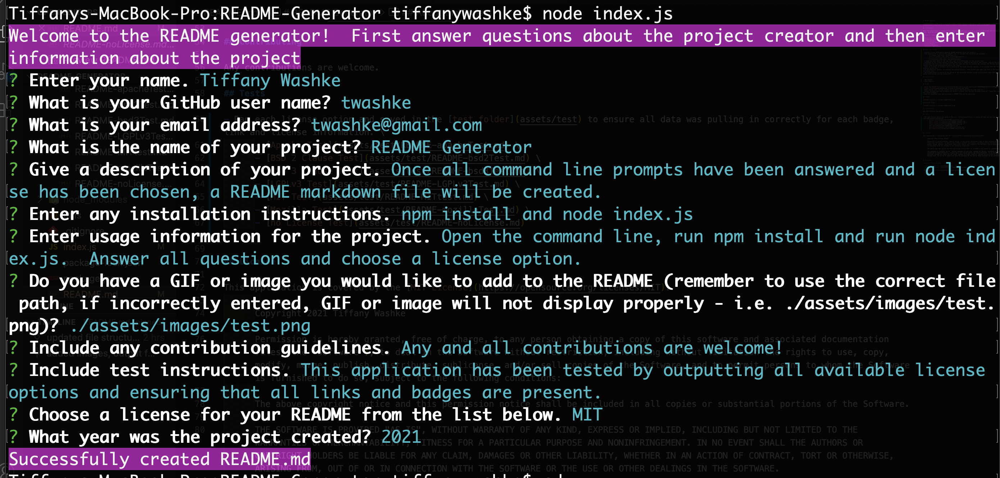
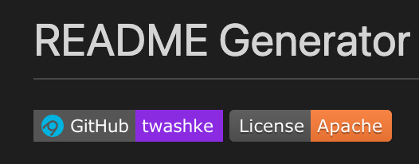
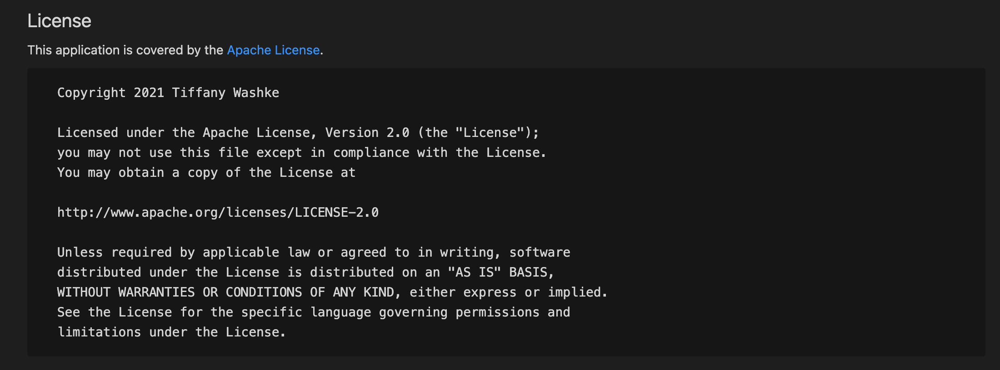
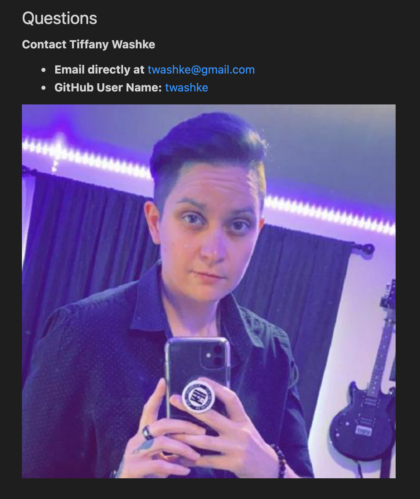

# README Generator

 

## Description

When this application is opened in the command line, the user is given a series of questions and license information to choose from.  Once all questions have been answered, a README markdown file will be created.

## Table of Contents 

- [About the Project](#about-the-project)
- [Installation](#installation)
- [Usage](#usage)
- [Contributing](#contributing)
- [Tests](#tests)
- [License](#license)
- [Questions](#questions)

## About the Project

- Created to help efficiently generate README markdown files for projects.
- This application is used on the command line, it includes the following npm packages: \
      - [fs](https://www.npmjs.com/package/fs) \
      - [inquirer](https://www.npmjs.com/package/inquirer) \
      - [axios](https://www.npmjs.com/package/axios) \
      - [chalk](https://www.npmjs.com/search?q=chalk)
- A badge has been added at the top that links to a GitHub Repo for the project owner.
- Depending on the license chosen, a badge (and link) is added at the top for the license, also in the License section, the license information (and link) are included with the user name and year the project was created (the Mozilla and LGPLv3 licenses only include links to the documentation due to the size).
- There is a prompt to include a gif or picture in the Usage section; however, it is crucial that the file path is correct to generate the picture.
- In the Questions section, it includes the project creator, there GitHub user name (and link to the repo) and there email address to contact them.
- The GitHub avatar is placed at the bottom of the Questions section (using [axios](https://www.npmjs.com/package/axios) to pull the avatar information from the GitHub API).

## Installation

- npm install
- node index.js

## Usage

- Watch the [README Generator Walkthrough](https://drive.google.com/file/d/1BCFBVEORgElU4vq7hfGFJbFSgpwuNK3_/view) for instructions.
- [Sample README](sampleREADME.md) created in walkthrough above.
- Open command line, run npm install (if it hasn't been done) and run node index.js.
- Answer the questions when prompted and choose a license from the list provided (none will leave the license section empty and will not create a badge).
- Once all questions have been answered, a README file will be generated.

Command Line Application View 

 

Badges Displayed at the Top 

 

Apache License Information 

 

GitHub Avatar 

 

## Contributing

Any contributions are welcome!

Thank you to [Joshua Washke](https://github.com/jwashke) for his help with tutoring.

## Tests

Ran each license option and saved in the [test folder](assets/test) to ensure all data was pulling in correctly for each badge, link and license information. \
      - [Apache Test](assets/test/README-apacheTest.md) \
      - [BSD 2 Clause Test](assets/test/README-bsd2Test.md) \
      - [BSD 3 Clause Test](assets/test/README-bsd3Test.md) \
      - [LGPLv3 Test](assets/test/README-LGPLv3Test.md) \
      - [MIT Test](assets/test/README-MITtest.md) \
      - [Mozilla Test](assets/test/README-mozillaTest.md) \
      - [no License Test](assets/test/README-noLicense.md) 

## License

This application is covered by the [MIT License](https://opensource.org/licenses/MIT). 
       
      Copyright 2021 Tiffany Washke

      Permission is hereby granted, free of charge, to any person obtaining a copy of this software and associated documentation files (the "Software"), to deal in the Software without restriction, including without limitation the rights to use, copy, modify, merge, publish, distribute, sublicense, and/or sell copies of the Software, and to permit persons to whom the Software is furnished to do so, subject to the following conditions:
      
      The above copyright notice and this permission notice shall be included in all copies or substantial portions of the Software.
      
      THE SOFTWARE IS PROVIDED "AS IS", WITHOUT WARRANTY OF ANY KIND, EXPRESS OR IMPLIED, INCLUDING BUT NOT LIMITED TO THE WARRANTIES OF MERCHANTABILITY, FITNESS FOR A PARTICULAR PURPOSE AND NONINFRINGEMENT. IN NO EVENT SHALL THE AUTHORS OR COPYRIGHT HOLDERS BE LIABLE FOR ANY CLAIM, DAMAGES OR OTHER LIABILITY, WHETHER IN AN ACTION OF CONTRACT, TORT OR OTHERWISE, ARISING FROM, OUT OF OR IN CONNECTION WITH THE SOFTWARE OR THE USE OR OTHER DEALINGS IN THE SOFTWARE.

## Questions

**Contact Tiffany Washke**

- **Email directly at** twashke@gmail.com
- **GitHub User Name:** [twashke](https://github.com/twashke)

 

