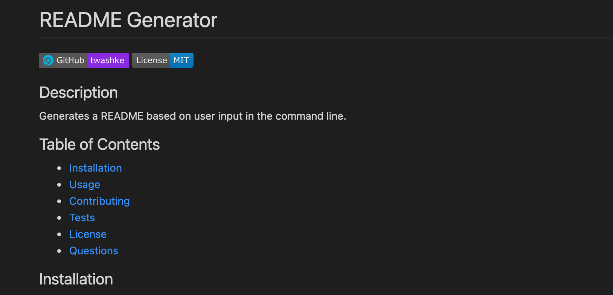

# README Generator Test

 

## Description

README Generator created based on user inputs in the command line.

## Table of Contents 

- [Installation](#installation)
- [Usage](#usage)
- [Contributing](#contributing)
- [Tests](#tests)
- [License](#license)
- [Questions](#questions)

## Installation

npm install and run node index.js

## Usage

Create a README!  
)

## Contributing

Contributions are welcome!

## Tests

Testing each license to ensure badge, link and information pulls correctly

## License

This application is covered by the [LGPLv3 License](https://opensource.org/licenses/LGPL-3.0).

## Questions

**Contact Tiffany Washke**

- **Email directly at** twashke@gmail.com
- **GitHub User Name:** [twashke](https://github.com/twashke)

 

